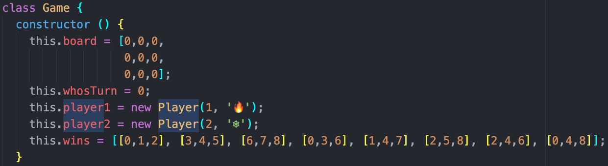
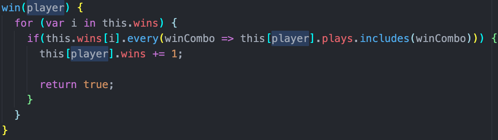

# Tic Tac toe

## How to access the project:

* First clone this repo from Github by going to the code button on the top right of the the J-dunny/tic-tac-toe repo. The link is at the bottom of the page.
* Next in your terminal type "git clone" then copy the HTTPS after and clone the repository.
* From there you will want to access the tic-tac-toe directory by typing 'cd tic-tac-toe' into your terminal.
* Once your have successfully cloned the repo and you are in the right directory you will want to type 'open index.html' into your terminal to open the project in a browser window to view.

* OR you can click the deploy link below.

## Overview

* This website was created using javascript and allows users to play a simple game of tic-tac-toe with a little fire and ice theme.
* One of the harder things about the tic-tac-toe challenge was to create DRY (Don't Repeat Yourself) code for the data model of how the wins were being accounted for.  
* There are 8 different ways in which a player could win. So I created a game board that is an array of zeros corresponding to the places in which a player can move on the screen. When a player moves on the screen that corresponding place in the array will change to the players ID. When a win condition is met then that player will win.

* I created a method that can iterate through the win conditions and check to see if either player meets any of the win criteria.

## User Win

* The site will keep track of each of the user wins.
* The game will reset automatically after each win.

## Game Draw

* If there is a draw the game will just reset the board and not add any points.

## Future Features:

* On hover the icons will be faintly displayed in the box before clicking.
* An animation will be added for a fiery or icy win!

## Contributors:
Jake Dunafon https://github.com/J-Dunny

## Links:

Repo link: https://github.com/J-Dunny/tic-tac-toe

Deploy link:  https://j-dunny.github.io/tic-tac-toe/
